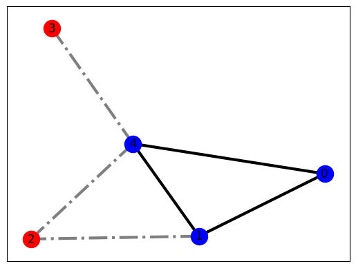

# Maximum Clique Problem
This code intends to analyse the performance of DW2000Q_6 and Advantage_system4.1
at solving the maximum clique problem. 

As an example, in the image above blue vertices and solid edges constitute a maximum clique

## Usage
There are two main files: 
* "Clique-Problem-RCS.py" implements the maximum clique problem and scans over relative chain strength (RCS)
* "Clique-Problem-Annealing-Time.py" implements the maximum clique problem and scans over annealing times.

In both cases one needs to provide a graph as a text file including its number of vertices, number of edges, and a list of all edges (many examples are given in this folder). 

## References
(https://en.wikipedia.org/wiki/Clique_problem)

## License

Released under the Apache License 2.0. See [LICENSE](LICENSE) file.
